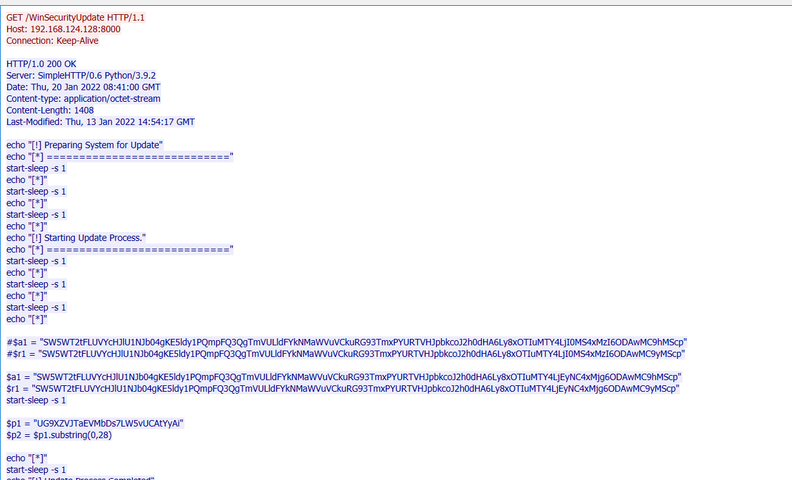
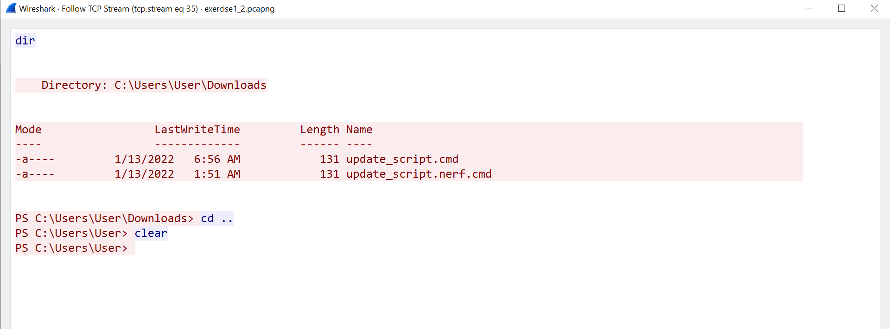

# Lab Exercise 1 - 191CS111

## Attack Setup

- Set up a Windows 11 VM (victim machine) and Kali VM (attacker machine)

- Download the `update_script.cmd` file in victim machine.

- Update the exploit script by changing the `base64` IPs to the attacker IP.

- Start wireshark capture on the virtual interface of host machine.

- Execute the `update_script.cmd` file.

- Captured Packet is [here](./exercise1_2.pcapng)

## Capture Analysis

- From *Protocol Hierarchy* stats we observe that compared to other Application Layers, `HTTP` is in majority of the capture. 
- We observer there are a total of 41 TCP conversations in this capture from *Conversations* ([here](./TCP_Conversations.csv)).
    - We observer most communication happens with `192.168.1.131` and `192.168.1.128`.
    - We observe the randomness of port distribution in B, with most of the ports being either 443 or 80 one of the open ports are 8000.
    - This conversation happens between what seems to be random ports of `192.168.1.131` with `192.168.1.128:8000`.
    - We can further analyse this TCP conversation.
- From *Endpoints* we can observe that IP `192.168.1.131` used a variaty of random ports for TCP connections while IP `192.168.1.128` used ports 443, 8000.
- We follow the TCP stream between `.131` and `.128`.

## TCP stream

### On port 8000

Apply the filter `ip.addr==192.168.124.131 && ip.addr==192.168.124.128 && tcp.port==8000` we observe multiple HTTP conections between both the IPs.

- The initial request was `GET /WinSecurityUpdate`.
- On viewing the first response 
- This seems to be a purposely obfuscated Powershell script. 
- We can decode the following `base64` encoded variables `$a1, $r1` and observe that they make another `GET` request to `/a1, r1` respective respectively.
- On observing their response we observe that the files sent were even more malicious powershell script that allowed the adversary (`192.168.1.128`) to gain a reverseshell on victim (`192.168.1.131`).

### On port 443

We observe the TCP stream  which is clear indication that the adversary had compromised the entire user session.