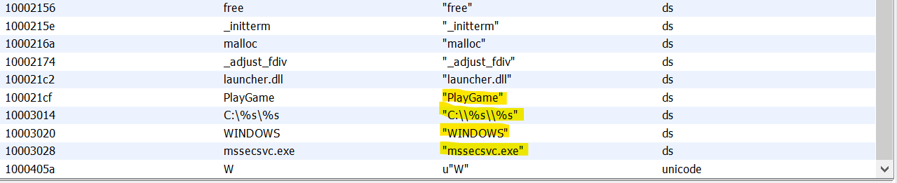

# CS851 - Lab 2 exercise (Malware Analysis)

## Student Information

```
Name: Ashutosh Anand

Roll: 191CS111
```
## About Malware

The provided sample is the infamous 'WannaCry_Plus' Ransomware. Security experts believed from preliminary evaluation of the worm that the attack originated from North Korea or agencies working for the country in 2017. It primarily targeted the Windows Operating System by encrypting (locking) data and demanding ransom payments in the Bitcoin cryptocurrency. The Rasomware also has the capabilities to transport itself across the network to infect other vulnerable machines. The malware was developed in Microsoft Visual C++ 6.0. This ransomware has costed around 4 billion USD.

The malware uses the EternalBlue exploit which makes use of the vulnerability in Windows SMB protocol. More at [CVE-2017-0144](https://www.cve.org/CVERecord?id=CVE-2017-0144).


## Set-Up for Analysis

- The entire simulation and analysis was performed inside Windows 10 VM, which is available from the official Microsoft development site.
- Ghidra and its dependencies were installed in the VM.
- The sample was downloaded from [this repository](https://github.com/ytisf/theZoo/tree/master/malware/Binaries/Ransomware.WannaCry_Plus).
- Later the VMs network configuration was switched to Host-Only mode to isolate the VM from spreading the threat.
- All of windows 10 default security settings was turned off (Including real time protection).

</br>
</br>
</br>
</br>
</br>
</br>
</br>
</br>
</br>
</br>
</br>
</br>
</br>
</br>
</br>


## Static Analysis 

### About file
- The downloaded malware is a single PE file, which is the standard executable file in windows.
- It is compiled using the `visualstudio` compiler. (Probably version 6.0)
- It is compiled to `x86` ISA and is little Endian.


### Symbol Tree
- *Imports*: 
    - `kernel32.dll`: Windows Kernel module.
    - `msvcrt.dll`: The C standard library for the Visual C++ (MSVC) compiler from version 4.2 to 6.0.

- *Functions*:
    - `entry`: Start function for the executable.

### Strings 


- Some suspicious strings include `C:\\%s\\%s` and `mssecsvc.exe`, which seems to be creating an extra `.exe` file.

</br>
</br>
</br>
</br>
</br>
</br>
</br>
</br>
</br>
</br>


### Call Graph


- It can be seen that the entry function calls two out of five user defined functions. 


- The `PlayGame` function calls the other two `FUN` function in the code which may seem to indicate that `PlayGame` maybe the actual intended entry function.

## Entry function Analysis

- Upon reading the code there seems to be the use of a function pointer, probably to make static analysis harder or to obfuscate code from anti-viruses or researchers.
- The pointer value is currently `NULL` since it is global, which means that its value gets updated during run time. 
- This pointer has been renamed to `unknown_function_pointer` for easier reading, it occurs twice ONLY in the `entry` function code.
- It is highly possible that this pointer points to the `PlayGame` function upon execution, further dynamic analysis will be required.


-  From the call graphs we were able to find the use of two more functions. 

### FUN_10001000


- It can be seen that a global variable of type `HMODULE` is set to `param_1` if `param_2 == 1` from the entry function parameters.
- The global variable is renamed to `entry_param_1` for ease of reading.

> NOTE: `HMODULE` is a handler for a particular module or binary (DLLs or executables).

-  always returns 1.

### FUN_1000113e

- This function does more of memory allocation which could not be easily understood even from decompiled mode.


### Conclusion of Entry function

- The unknown function pointer needs to be analyzed dynamically to understand which function does it point to exactly, but as per our intuition it could be the PlayGame function since its never called in the entry function.

- `FUN_10001000` function seems to set the `entry_param_1` global variable to `param_1` from entry function.

- FUN_1000113e function seems to be doing weird memory allocation, could be for obfuscation or evasion.


</br>
</br>
</br>
</br>
</br>
</br>
</br>
</br>


## Analysis of PlayGame function


- Analyzing the `sprintf` function it looks like the `char` pointer `mal_mssecsvc_exe` (renamed) stores the string `"C:\\WINDOWS\\mssecsvc.exe"`, which seems to be storing the path of executable.

### FUN_10001016


- [`FindResourceA`](./https://docs.microsoft.com/en-us/windows/win32/api/winbase/nf-winbase-findresourcea), to find resource in module handled by `entry_param_1` global variable.
- If the resource is found in the module then its loaded and locked.
- The `LockResource` function returns a pointer to the resource in memory.
- After successful loading and locking a file is created using `CreateFileA` function in the `C:\\WINDOWS\mssecsvc.exe` path.
- After creating the file, data is written into it from the `pDVar1 + 1` location of the resource.
    - `pDVar1` is the pointer to the resource in memory located from module handled by `entery_param_1` variable. 

> NOTE: `entry_param_1` variable is either `param_1` from entry function or NULL depending on `param_2` value from entry function.

</br>
</br>
</br>
</br>

### FUN_100010ab


- The next function to be executed in PlayGame.
- The only function loaded from the exported dll module is [`CreateProcessA`](https://docs.microsoft.com/en-us/windows/win32/api/processthreadsapi/nf-processthreadsapi-createprocessa) function.
- The command passed to it is from the `mal_mssecsvc_exe` variable whose value is the path to the `mssecsvc.exe` executable. This file, as we know, has been created and written by the previous (`FUN_10001016`) function.
- Hence basically the `mssecsvc.exe` file is executed and its identification information is stored in `local_14` variable.

### Conclusion of PlayGame

- The intention of `PlayGame` function seems to be clear, it creates a `mssecsvc.exe` executable file, writes data into it and the executes it.
- Online research of the `mssecsvc.exe` file shows that it is a malicious executable that is created by WannaCry ransomware, which is proven by this analysis.
- Question on what data is exactly written into this file and how the `PlayGame` function is called and executed still remains. An assumption that memory allocated and used in `FUN_1000113e` function is maybe written into the file.
- Due to the limitations of static analysis on ghidra, it is difficult to know what exactly was written into this file and further analysis could be continued.

## Future Work 

- Would like to continue with the dynamic analysis of the ransomware and perform its indepth analysis on a VM.
- Compare `WannaCry_Plus` with `WannaCry` ransomware.